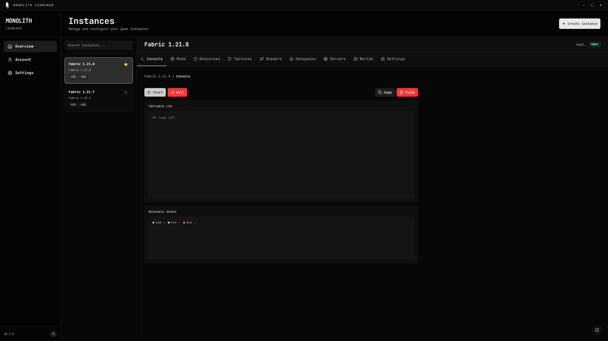

# Monolith Launcher

Cross-platform Minecraft Java launcher built with Tauri, Rust, Next.js, and Bun.

[](https://github.com/dvnxvll/MonolithLauncher/releases/latest)
[](https://github.com/dvnxvll/MonolithLauncher/releases/tag/nightly)



## Highlights
- Multi-instance management with isolated directories and pinning
- Loader support: Vanilla, Fabric, Forge, NeoForge
- Microsoft authentication and ownership checks
- Modrinth integration for mods, resource packs, shaders, and datapacks
- Instance console with launcher and client log streams
- Runtime metrics panel (RAM, CPU, GPU)
- Discord Rich Presence integration

## Downloads
- Latest stable: https://github.com/dvnxvll/MonolithLauncher/releases/latest
- Nightly prerelease: https://github.com/dvnxvll/MonolithLauncher/releases/tag/nightly

Common Linux artifacts:
- `monolith-launcher-v<version>-linux-<arch>` (raw executable)
- `monolith-launcher-v<version>-linux-<arch>.run` (self-extracting launcher)
- `monolith-launcher-v<version>-linux-<arch>.AppImage` (portable bundle)
- `monolith-launcher-v<version>-linux-<arch>.deb`
- `monolith-launcher-v<version>-linux-<arch>.rpm`

## Installation
Installation guides are in [docs/GETTING_STARTED.md](docs/GETTING_STARTED.md).

## Build From Source
Requirements:
- Bun
- Rust toolchain (`1.77.2+`)
- Tauri CLI v2
- Platform-specific Tauri system dependencies

Development:
```bash
./dev.sh
```

Windows:
```bat
.\dev.bat
```

Windows users should use `dev.bat` and should not run `dev.sh`.

Optional dev flags:
- `--tips` or `--tour`
- `--update-test`

Production build:
```bash
./build.sh
```

Windows:
```bat
.\build.bat
```

Windows users should use `build.bat` and should not run `build.sh`.

Artifacts are generated under `src-tauri/target/release/bundle/`.

## Documentation
- Getting started: [docs/GETTING_STARTED.md](docs/GETTING_STARTED.md)
- Changelog: [docs/CHANGELOG.md](docs/CHANGELOG.md)

## License
MIT. See `LICENSE`.
